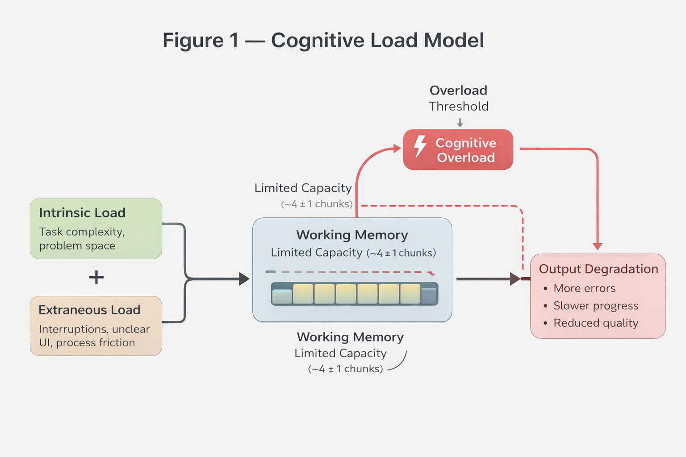

# Cognitive Load Is the Missing Layer in Developer Experience

---

## Why This Matters

Engineering teams invest heavily in tooling, process, and culture. Yet a fundamental constraint of human performance is rarely named in any of it.

Cognitive load — the demand placed on working memory during complex tasks — directly limits how much a person can think, decide, and execute at once.

When engineering systems are designed without accounting for that limit, the cost shows up predictably: errors, slowdowns, disengagement, and burnout.

This cost is structural. It is not mysterious.

---

## The Core Idea

Modern engineering systems optimize for procedural efficiency but rarely account for individual cognitive capacity.

Agile rituals, sprint cycles, productivity metrics, and collaboration norms implicitly assume uniform working memory and context-switching tolerance. When cognitive load is left unexamined, developer experience becomes misaligned with human limits — particularly for neurodivergent engineers.

Cognitive load should be treated as a first-class design constraint in engineering systems.

---

## A Brief Model of Cognitive Load

Cognitive Load Theory, introduced by John Sweller in 1988, describes working memory as a bounded resource.

Earlier research by George Miller suggested humans can hold roughly seven (plus or minus two) chunks of information. More recent research indicates that effective capacity under novel conditions may be closer to ~4 meaningful chunks.

The exact number matters less than the constraint: working memory is limited.

Sweller distinguishes between three types of load:

- **Intrinsic load** — the inherent complexity of the task.
- **Extraneous load** — friction introduced by environment, process, or presentation.
- **Germane load** — effort devoted to learning and long-term understanding.

Intrinsic and extraneous load draw from the same finite pool. When extraneous load is high, less capacity remains for productive thinking and learning.

*Working memory is a fixed resource. Reducing extraneous load increases the space available for productive cognitive work.*

---

## How This Shows Up in Engineering

### Agile Rituals and Structural Interruption

Agile methods were designed to improve adaptability. In many ways, they succeed.

But standard implementations introduce a high baseline of extraneous load:

- Daily standups interrupt deep work.
- Sprint planning requires simultaneous estimation, coordination, and task complexity modeling.
- Backlog grooming and refinement sessions increase context switching.
- Slack and asynchronous pings fragment attention throughout the day.

Research on interruption recovery shows that after a disruption, workers require substantial time to return to the same depth of focus. When interruptions are embedded structurally rather than occurring occasionally, recovery time becomes a hidden throughput cost.

This is not an argument against Agile. It is an argument that cognitive overhead is rarely treated as a design variable.

---

### Uniform Process, Non-Uniform Humans

Engineering teams are not cognitively uniform.

Working memory capacity, executive function, and context-switch tolerance vary widely. ADHD — affecting an estimated 5–8% of adults — is associated with working memory variability and task-switch sensitivity. Even without formal diagnosis, sleep, anxiety, and environmental factors affect moment-to-moment capacity.

Process uniformity does not produce experiential uniformity.

When high extraneous load disproportionately impacts certain engineers, what appears to be a performance gap is often a load gap.

Behaviors correlated with overload — missed details, slower delivery, avoidance — are frequently misattributed to motivation rather than system mismatch.

---

## Practical Implications

If cognitive load were treated as a design constraint, engineering systems might:

- Track interruption density and meeting load.
- Limit parallel work-in-progress more aggressively.
- Protect uninterrupted deep-work windows.
- Batch context-heavy collaboration.
- Design tickets and requirements to reduce ambiguity.
- Allow variation in communication and collaboration styles.

Reducing extraneous load is not a wellness initiative. It is an engineering problem.

Burnout research consistently shows that sustained overload leads to disengagement and attrition. When overload is framed as an individual weakness rather than a compositional systems issue, interventions target the wrong variable.

---

## References

Sweller, J. (1988).  
*Cognitive load during problem solving: Effects on learning.*  
Cognitive Science, 12(2), 257–285.  
https://doi.org/10.1207/s15516709cog1202_4

Miller, G. A. (1956).  
*The magical number seven, plus or minus two: Some limits on our capacity for processing information.*  
Psychological Review, 63(2), 81–97.  
https://doi.org/10.1037/h0043158

Mark, G., Gudith, D., & Klocke, U. (2008).  
*The cost of interrupted work: More speed and stress.*  
Proceedings of the SIGCHI Conference on Human Factors in Computing Systems.  
https://doi.org/10.1145/1357054.1357072

Barkley, R. A. (2012).  
*Executive Functions: What They Are, How They Work, and Why They Evolved.*  
Guilford Press.

Maslach, C., & Leiter, M. P. (2016).  
*Understanding the burnout experience: Recent research and its implications for psychiatry.*  
World Psychiatry, 15(2), 103–111.  
https://doi.org/10.1002/wps.20311

Forsgren, N., Humble, J., & Kim, G. (2018).  
*Accelerate: The Science of Lean Software and DevOps.*  
IT Revolution Press.

---

## Closing Reflection

The question is not whether cognitive limits are real. That is settled.

The question is whether we are willing to treat them as design inputs rather than individual shortcomings.

Engineering culture has become adept at identifying system-level causes of technical failure. Applying that same discipline to the humans inside those systems reveals that much of what looks like a people problem is a load problem waiting for a better description.
