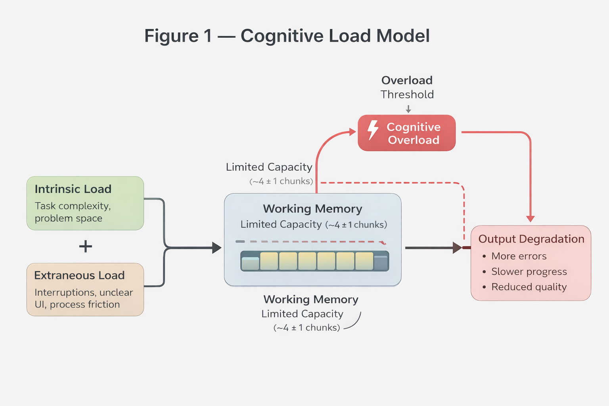

# 🧠 Cognitive Load Is the Missing Layer in Developer Experience

<!-- 
ALT TEXT (Medium):
Abstract diagram showing a constrained system under increasing pressure with limited capacity
-->

*Conceptual representation of cognitive load as a bounded system under pressure.
This image was generated using AI as a conceptual illustration.*

---

## Table of Contents

* Introduction
* The Core Idea
* A Brief Model of Cognitive Load
* How This Shows Up in Engineering

  * Agile Rituals and Structural Interruption
  * Uniform Process, Non-Uniform Humans
* Practical Implications
* Closing Reflection

---

## Introduction

Engineering teams invest heavily in tooling, process, and culture. Yet a fundamental constraint of human performance is rarely named in any of it.

Cognitive load — the demand placed on working memory during complex tasks — directly limits how much a person can think, decide, and execute at once.

When systems are designed without accounting for that limit, the cost shows up predictably:

* errors
* slowdowns
* disengagement
* burnout

This cost is structural, not mysterious. Just often overlooked.

---

## The Core Idea

Modern engineering systems optimize for procedural efficiency, but rarely account for individual cognitive capacity.

Agile rituals, sprint cycles, productivity metrics, and collaboration norms implicitly assume uniform working memory and context-switching tolerance.

When cognitive load is left unexamined, developer experience becomes misaligned with human limits — particularly for neurodivergent engineers.

Cognitive load is not a secondary concern.

It is a design constraint.

---

## A Brief Model of Cognitive Load

Cognitive Load Theory, introduced by John Sweller in 1988, describes working memory as a bounded resource.

Earlier research by George Miller suggested humans can hold roughly seven (plus or minus two) chunks of information. More recent research indicates that effective capacity under novel conditions may be closer to ~4 meaningful chunks.

The exact number matters less than the constraint:

> working memory is limited.

Sweller distinguishes between three types of load:

* **Intrinsic load** — the inherent complexity of the task
* **Extraneous load** — friction introduced by environment, process, or presentation
* **Germane load** — effort devoted to learning and long-term understanding

Intrinsic and extraneous load draw from the same finite pool.

When extraneous load is high, less capacity remains for productive thinking and learning.

<!-- 
ALT TEXT (Medium):
Diagram showing working memory divided between intrinsic, extraneous, and germane cognitive load
-->

*Working memory is a fixed resource. Reducing extraneous load increases the space available for productive cognitive work.
This image was generated using AI as a conceptual illustration.*

---

## How This Shows Up in Engineering

### Agile Rituals and Structural Interruption

Agile methods were designed to improve adaptability. In many ways, they succeed.

But standard implementations introduce a high baseline of extraneous load:

* daily standups interrupt deep work
* sprint planning requires simultaneous estimation, coordination, and modeling
* backlog refinement increases context switching
* asynchronous pings fragments attention throughout the day

Research on interruption recovery shows that after a disruption, it takes significant time to return to the same depth of focus.

When interruptions are structural rather than occasional, recovery becomes a hidden throughput cost.

This is not an argument against Agile.

It’s an argument that cognitive overhead is rarely treated as a design variable.

---

### Uniform Process, Non-Uniform Humans

Engineering teams are not cognitively uniform.

Working memory capacity, executive function, and context-switch tolerance vary widely. ADHD — affecting an estimated 5–8% of adults — is associated with working memory variability and task-switch sensitivity.

Even without formal diagnosis, sleep, stress, and environment shift capacity moment to moment.

Process uniformity does not produce experiential uniformity.

When high extraneous load disproportionately impacts certain engineers, what looks like a performance gap is often a load mismatch.

Behaviors like:

* missed details
* slower delivery
* avoidance

are often interpreted as motivation problems.

But they are frequently capacity problems.

---

## Practical Implications

If cognitive load were treated as a design constraint, engineering systems might:

* track interruption density and meeting load
* limit parallel work-in-progress more aggressively
* protect uninterrupted deep-work windows
* batch context-heavy collaboration
* reduce ambiguity in tickets and requirements
* allow variation in communication styles

Reducing extraneous load is not a wellness initiative.

It is an engineering problem.

Burnout research consistently shows that sustained overload leads to disengagement and attrition.

When overload is framed as an individual weakness instead of a system property, interventions target the wrong variable.

---

## Closing Reflection

Cognitive limits are not theoretical.

They are operational.

The question is not whether they exist.

The question is whether we design with them in mind.

Engineering culture is good at identifying system-level causes of technical failure.

Applying that same lens to the humans inside those systems reveals something simple:

> what looks like a people problem is often a load problem waiting for a better description.

---

## References

Sweller, J. (1988).
*Cognitive load during problem solving: Effects on learning.*
Cognitive Science, 12(2), 257–285.
<https://doi.org/10.1207/s15516709cog1202_4>

Miller, G. A. (1956).
*The magical number seven, plus or minus two: Some limits on our capacity for processing information.*
Psychological Review, 63(2), 81–97.
<https://doi.org/10.1037/h0043158>

Mark, G., Gudith, D., & Klocke, U. (2008).
*The cost of interrupted work: More speed and stress.*
Proceedings of the SIGCHI Conference on Human Factors in Computing Systems.
<https://doi.org/10.1145/1357054.1357072>

Barkley, R. A. (2012).
*Executive Functions: What They Are, How They Work, and Why They Evolved.*
Guilford Press.

Maslach, C., & Leiter, M. P. (2016).
*Understanding the burnout experience: Recent research and its implications for psychiatry.*
World Psychiatry, 15(2), 103–111.
<https://doi.org/10.1002/wps.20311>

Forsgren, N., Humble, J., & Kim, G. (2018).
*Accelerate: The Science of Lean Software and DevOps.*
IT Revolution Press.

---

*This article was written by Alan Szmyt, with AI used as a tool for structuring, refinement, and visual generation. All ideas originate from the author's own thinking.*
