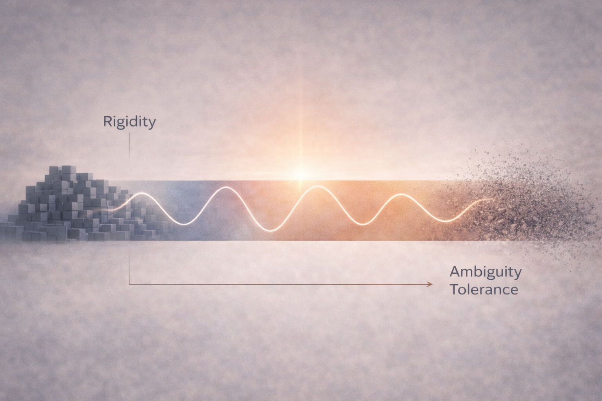
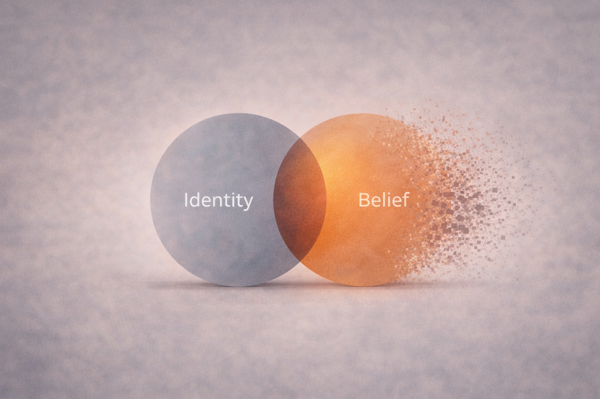
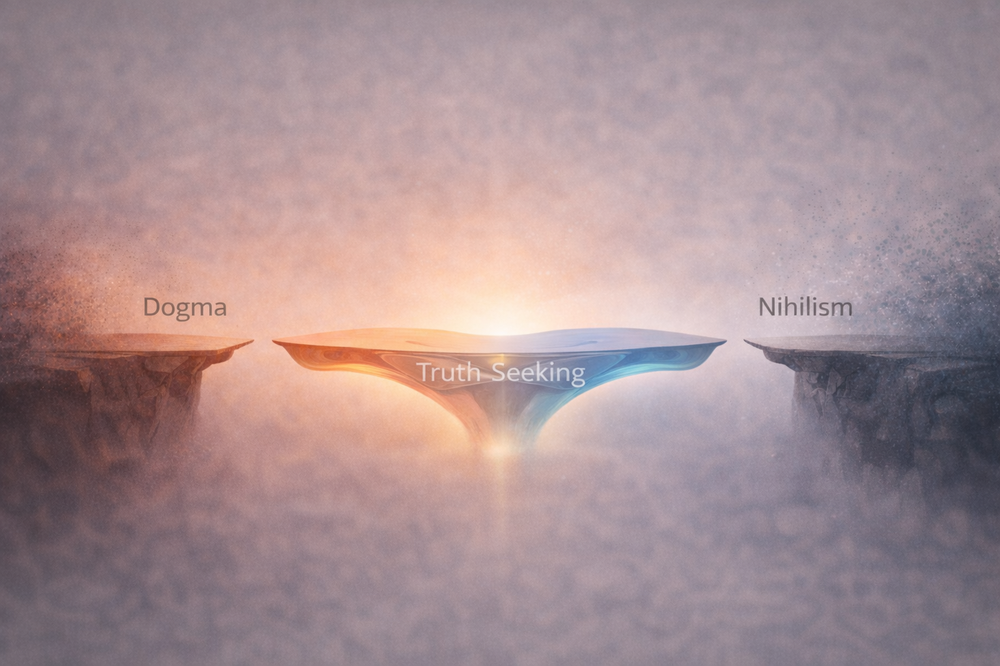

# Between Dogma and Nothingness

At first glance, dogmatism and nihilism appear to be opposites.

One insists that truth is already known and must be defended.  
The other dismisses truth entirely, dissolving meaning into indifference.

One clings tightly to certainty.  
The other abandons certainty altogether.

But psychologically, they are closer than they appear.

Both are strategies for escaping uncertainty.

---

## The Appeal of Dogma

Certainty stabilizes the mind.

When a belief feels absolute, cognitive tension drops. Ambiguity narrows. The world becomes easier to interpret.

Rigid ideologies reduce complexity. They compress the vast uncertainty of reality into a single narrative.

This reduction can feel like relief.

But when belief becomes identity, conviction stops being about truth and starts being about protection.

Challenges to the belief feel like threats — not to ideas, but to the self.

Dogma is rarely about pure confidence.

More often, it is about psychological stability.

---

## The Seduction of Nothingness

Nihilism often presents itself as the opposite.

Instead of asserting meaning, it rejects meaning entirely.

If nothing ultimately matters, then nothing needs defending.  
If values are arbitrary, contradiction no longer destabilizes the system.

This can feel freeing.

But the freedom is deceptive.

Where dogma collapses complexity into certainty, nihilism collapses complexity into indifference.

Both remove the burden of navigating ambiguity.

Both reduce the tension of unresolved questions.

Both promise relief.

---

## The False Opposition

Dogmatism and nihilism appear to stand at opposite ends of a spectrum.

Yet structurally, they solve the same psychological problem.

Uncertainty creates cognitive strain.  
Ambiguity generates internal pressure.

Dogma resolves this by overcommitting.  
Nihilism resolves it by disengaging.

Both collapse complexity rather than learning to hold it.

Both reduce ambiguity tolerance.

Both trade flexibility for psychological stability.

---

*Dogma and nihilism appear opposite, but both collapse ambiguity. Truth-seeking requires movement through belief space rather than permanent residence at either extreme.*

---

## Identity Fusion

The deeper issue is not belief content.

It is identity fusion.

When belief fuses with identity, flexibility disappears.

If I **am** my ideology, disagreement becomes threat.  
If I **am** my skepticism, commitment becomes weakness.  
If I **am** my doubt, conviction becomes betrayal.

Research in psychology shows that threats to core beliefs activate many of the same neural systems associated with physical threat. The brain struggles to distinguish between intellectual disagreement and social danger.

This is why debates escalate.

This is why people double down when challenged.

The mind is not defending truth.

It is defending identity.

---

*When belief and identity fully overlap, disagreement feels like a personal attack. Separating identity from belief restores flexibility.*

---

## Stability in the Middle

The middle position is less dramatic.

It does not claim absolute certainty.  
It does not abandon meaning entirely.

Instead, it allows conviction without rigidity.

Beliefs remain strong but revisable.  
Questions remain open without collapsing into nothingness.

Identity becomes separate from ideology.

This posture requires discipline.

It means tolerating ambiguity without demanding immediate resolution.  
It means allowing beliefs to update without feeling like the self is under attack.

But it creates something rare:

Stability without rigidity.

---

*Stability emerges when conviction and flexibility coexist. Extremes collapse ambiguity; the middle learns to navigate it.*

---

## Closing Reflection

Dogma promises certainty.

Nothingness promises freedom.

Both offer relief from ambiguity.

But relief purchased through rigidity is fragile.

The alternative is quieter.

Hold belief lightly.  
Hold doubt responsibly.  
Separate identity from ideology.  
Allow conviction to remain revisable.

Truth-seeking is not a fixed position.

It is the willingness to move.
