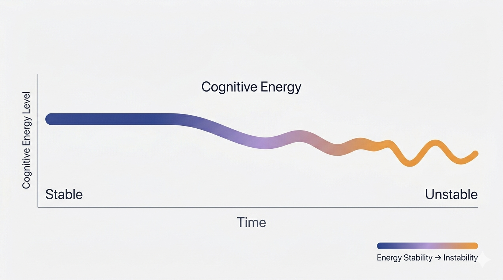
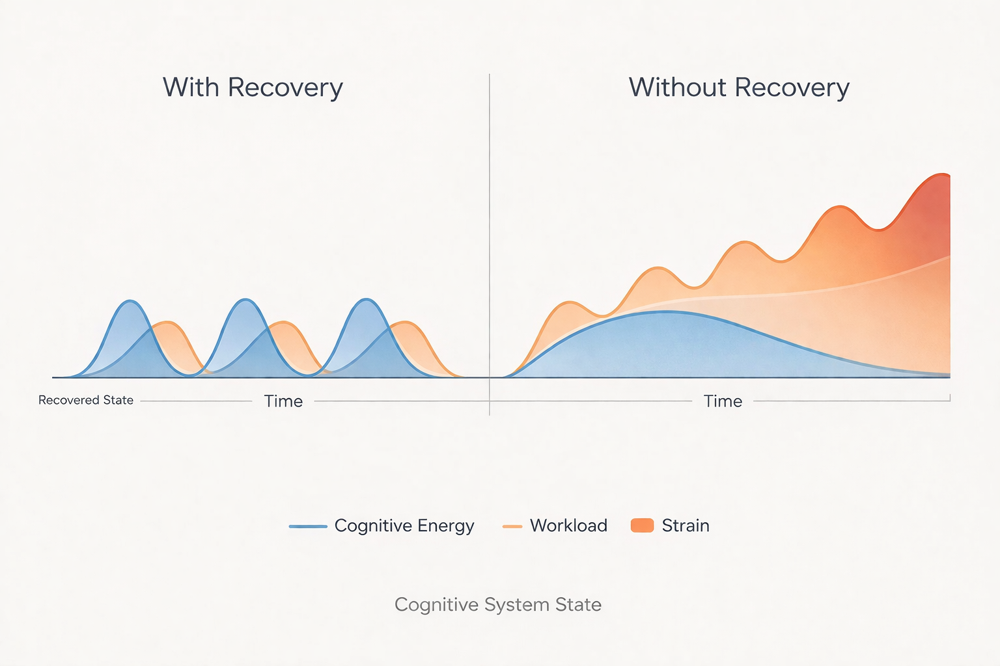

# 🔋 Cognitive Work Has Recovery Limits

<!-- 
ALT TEXT (Medium):
Person sitting at a desk appearing mentally fatigued while working, surrounded by notes and a clock indicating prolonged effort
-->

*Cognitive work draws from finite biological energy. Without recovery, systems don’t return to baseline—they accumulate strain over time. This image was generated using AI.*

---

## Table of Contents

* Introduction
* Cognitive Work Is Biological Work
* Engineering Concentrates Cognitive Load
* The Missing Recovery Loops
* When Overload Is Misread
* Awareness as the First Recovery Mechanism
* Closing Reflection

---

## Introduction

## Why high-cognitive professions quietly exceed human recovery capacity

Modern knowledge work often assumes that thinking is frictionless.

You sit down, you focus, you produce. If something goes wrong, the assumption is usually that something is wrong with your discipline, your motivation, or your ability to concentrate.

But sustained cognitive effort is not free.

> It is biological work.

---

## Cognitive Work Is Biological Work

The brain is one of the most energy-intensive systems in the body.

Even at rest, it consumes a disproportionate amount of metabolic energy. When engaged in sustained reasoning—debugging, designing systems, holding multiple abstractions in working memory—that demand increases.

Cognitive effort draws from finite resources:

* energy availability
* attention capacity
* emotional regulation
* stress tolerance

Over time, these systems fatigue.

This fatigue is not a lack of willpower.

> It is a biological constraint.

---

<!-- 
ALT TEXT (Medium):
Graph showing cognitive energy decreasing during work and recovering over time with rest
-->

*Cognitive energy is consumed during effort and restored through recovery. This image was generated using AI.*

---

## Engineering Concentrates Cognitive Load

Not all work distributes effort the same way.

Some forms of labor blend physical movement, interaction, and variation. Engineering, by contrast, concentrates effort into sustained abstract reasoning:

* long periods of deep focus
* complex system simulation in the mind
* debugging invisible states
* maintaining multiple layers of context

The work is quiet, but the demand is intense.

Over time, the system accumulates strain.

---

## The Missing Recovery Loops

All systems that sustain output require recovery loops.

In human terms, these include:

* sleep
* mental disengagement
* physical movement
* emotional processing
* shifts in attention

When these loops are present, cognitive systems remain stable.

Load increases, recovery follows, and the system returns to baseline.

When recovery is missing, the system behaves differently.

> Load no longer resets. It accumulates.

---

<!-- 
ALT TEXT (Medium):
Comparison chart showing cognitive load returning to baseline with recovery versus continuously increasing without recovery
-->

*With recovery, cognitive load returns to baseline. Without recovery, it accumulates over time—even when workload remains similar. This image was generated using AI.*

---

At first, this accumulation is subtle.

Then it becomes noticeable:

* slower thinking
* reduced clarity
* increased friction

Eventually, it becomes destabilizing.

---

## When Overload Is Misread

One of the most difficult aspects of cognitive overload is how it appears.

From the inside, it can feel like a collapse:

* thoughts become harder to hold
* reasoning becomes fragmented
* simple problems feel inaccessible

From the outside, it often looks like something else:

* lack of motivation
* inconsistency
* underperformance

This creates a dangerous misinterpretation.

Instead of recognizing overload, the system applies more pressure.

---

<!-- 
ALT TEXT (Medium):
Feedback loop diagram showing workload increases leading to overload, reduced performance, and increased pressure
-->

*When overload is misinterpreted as underperformance, systems reinforce the problem instead of correcting it. This image was generated using AI.*

---

The result is a reinforcing loop:

more demand → more overload → worse performance → more pressure

The system does not correct itself.

> It amplifies the failure.

---

## Awareness as the First Recovery Mechanism

The first step is not optimization.

It is recognition.

Cognitive work has limits.

Recovery is not optional.

> It is structural.

Understanding this changes the framing:

* from “why can’t I keep up?”
* to “what is the system doing under load?”

This shift allows for:

* more sustainable pacing
* better system design
* more accurate interpretation of performance

The goal is not to eliminate effort.

It is to align effort with recovery.

Because in cognitive systems, energy is not free.

> It is borrowed—and it must be repaid.

---

## Closing Reflection

You can push a system beyond its limits.

For a while, it will still produce.

But it will not remain stable.

Cognitive work is no different.

> Without recovery, performance is not maintained—it is delayed failure.

---

## References

Arnsten, A. F. T. (2009).
Stress signalling pathways that impair prefrontal cortex structure and function.
*Nature Reviews Neuroscience.*
<https://doi.org/10.1038/nrn2648>

Boksem, M. A. S., & Tops, M. (2008).
Mental fatigue: Costs and benefits.
*Brain Research Reviews.*
<https://doi.org/10.1016/j.brainresrev.2008.07.001>

Maslach, C., & Leiter, M. P. (2016).
Understanding the burnout experience: Recent research and its implications for psychiatry.
*World Psychiatry.*
<https://doi.org/10.1002/wps.20311>

Raichle, M. E., & Gusnard, D. A. (2002).
Appraising the brain’s energy budget.
*Proceedings of the National Academy of Sciences.*
<https://doi.org/10.1073/pnas.172399499>

Sweller, J. (1988).
Cognitive load during problem solving: Effects on learning.
*Cognitive Science.*
<https://doi.org/10.1207/s15516709cog1202_4>

Newport, C. (2016).
*Deep Work: Rules for Focused Success in a Distracted World.*
Grand Central Publishing

---

*This article was written by Alan Szmyt, with AI used as a tool for structuring, refinement, and visual generation. All ideas originate from the author's own thinking.*
