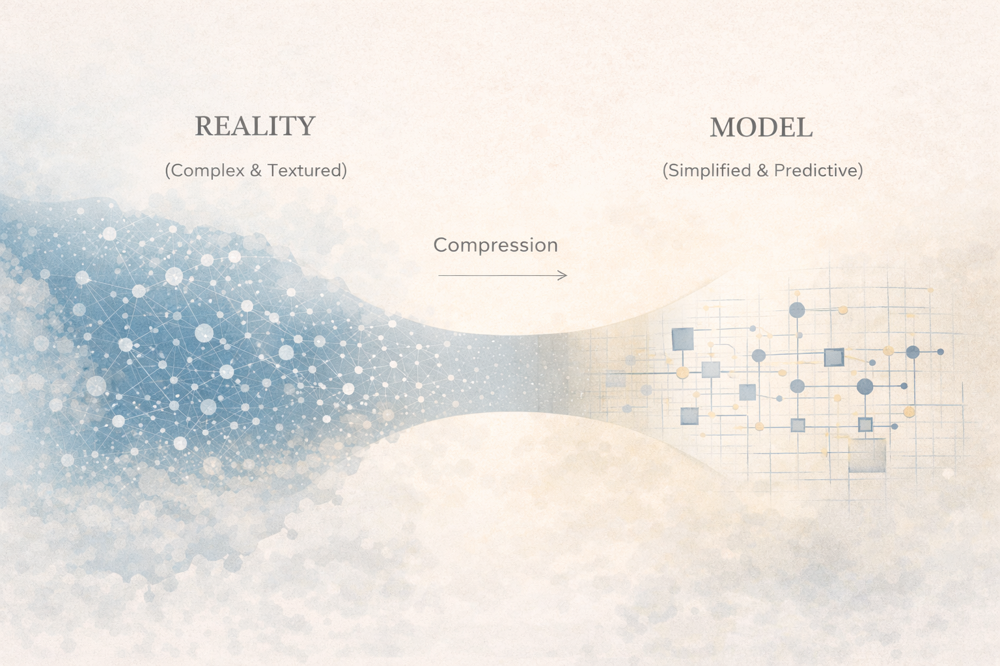
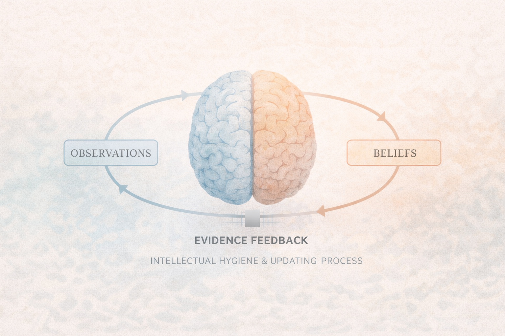

# Living Without Absolute Answers

I used to think that intellectual maturity meant getting closer to certainty.

Better models. Better reasoning. Fewer contradictions. Cleaner explanations.

But the deeper I went—into engineering, philosophy, and lived experience—the more obvious something became:

Absolute metaphysical certainty is unavailable.

And yet, systems still run. Bridges still stand. Code still compiles. Life still unfolds.

So maybe certainty was never the point.

---

## The Illusion of Absolute Certainty

Human cognition craves closure. Ambiguity consumes energy. Open loops create tension.

In professional environments—especially engineering cultures—confidence is often rewarded. Clear answers move projects forward. Definitive statements signal competence.

But epistemic confidence and psychological certainty are not the same thing.

History repeatedly shows that scientific models evolve. Newtonian mechanics gave way to relativity. Classical physics yielded to quantum mechanics. Frameworks expand, refine, and sometimes collapse under new evidence.

Yet engineers never waited for final metaphysical closure before building.

They operated with the best models available at the time.

The desire for absolute certainty is psychological.
The discipline of high-confidence modeling is practical.

That distinction matters.

---

## Models, Not Truths

Science does not deliver metaphysical proclamations. It constructs models.

A model is a compression of reality—structured, simplified, and usable. It is not reality itself.

We often forget this because reliable models feel like truth.

But reliability and ontology are different categories.

A bridge stands not because engineers know ultimate reality, but because their stress calculations are sufficiently predictive within known constraints.

In philosophy of science, this posture is called fallibilism—the recognition that knowledge is provisional and revisable without being useless.

Probabilistic reasoning frameworks—especially Bayesian thinking—formalize this idea: update confidence based on evidence, but never assume infallibility.

Operating with high-confidence models is not weakness.
It is disciplined humility.

---

*Figure 1 — Models compress reality. They do not mirror it.*

---

## The Cost of Rigid Ideology

When belief fuses with identity, flexibility collapses.

Rigid certainty creates fragility. Any contradiction becomes threat.

On the opposite extreme, radical skepticism dissolves structure. If nothing can be known at all, action becomes paralyzed.

Dogmatism and nihilism appear opposed, but psychologically they share something: instability.

For technically trained minds, this tension can be subtle.

We want clean models.
We want coherent systems.
We want resolution.

But forcing resolution beyond evidence creates ideological rigidity.
Abandoning resolution entirely creates collapse.

Stability lives in between.

---

*Figure 2 — Stability exists between rigid certainty and total collapse.*

---

## Operating with High-Confidence Models

Engineers already operate under uncertainty.

Load tolerances include safety margins.
Distributed systems assume failure.
Machine learning models output probabilities, not guarantees.

We design for reliability within limits.

What if this posture extended beyond engineering?

You do not need metaphysical certainty to live well.
You need models that work reliably enough to move forward.

“I can’t know with metaphysical certainty, but I can operate with high-confidence models.”

That sentence is not resignation.
It is freedom.

It allows action without absolutism.
Humility without paralysis.

---

## Intellectual Hygiene

Certainty is not a destination. It is a maintenance problem.

Beliefs require updating.
Models require revision.
Assumptions require inspection.

This is not existential crisis.
It is system upkeep.

Intellectual hygiene means:

- Separating identity from belief.
- Updating when evidence shifts.
- Holding confidence proportionally to support.
- Allowing revision without ego collapse.

Balance is not perfection.
It is iteration.

---

*Figure 3 — Experience drives model updates in an ongoing loop.*

---

## Closing Reflection

You will not solve reality.

You will not eliminate uncertainty.

You will not reach final epistemic ground.

But you can operate intelligently.

You can design systems that work.
You can revise when they fail.
You can hold paradox without breaking.

Absolute answers are not required.

High-confidence models are enough.
