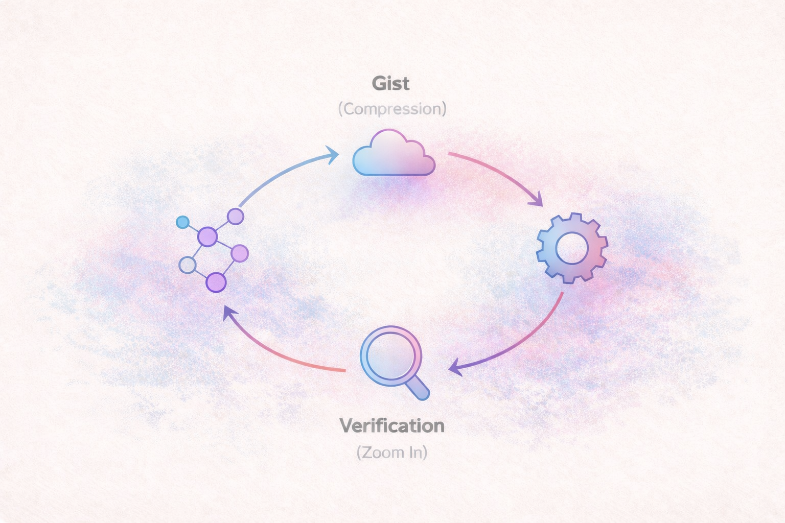
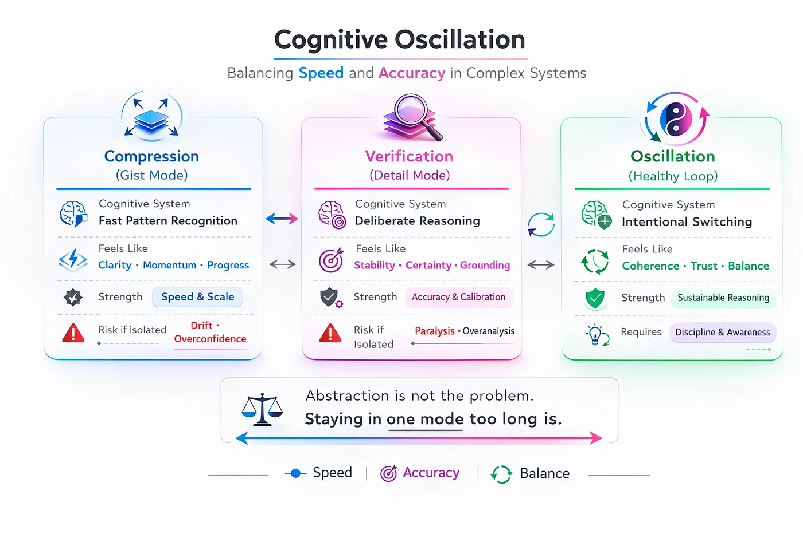

# There Is No Black Box

---

## Why This Matters

In conversations about artificial intelligence, one phrase appears repeatedly: *black box*.

It carries a quiet accusation.  
Opacity. Unknowability. Loss of control.

But engineers work with black boxes every day.

The real question is not whether black boxes exist.  
It’s whether we understand what a black box actually is.

---

## Encapsulation Is Not Ignorance

Software engineering depends on abstraction.

Functions hide implementation.  
APIs hide systems.  
Modules hide internal state.  
Libraries hide entire domains of complexity.

From the outside, these are black boxes.

From the inside, they are simply another level of zoom.

Encapsulation is not a flaw in engineering — it is how we survive complexity under cognitive limits.

Cognitive Load Theory shows that working memory is limited. We cannot hold every internal detail of every system simultaneously. Abstraction allows us to compress complexity into manageable units.

The black box is not ignorance.  
It is a boundary.

---

## Zoom Is Relative

No engineer ever sees the entire system at once.

Zoom out, and complex structures collapse into single blocks.  
Zoom in, and those blocks unfold into submodules.  
Zoom in further, and those submodules become interconnected components.

What appears opaque from one perspective becomes legible from another.

There is no absolute vantage point from which the entire graph is visible simultaneously.

What we call a “black box” is often just a boundary between levels of abstraction.

---

## AI as Scaled Encapsulation

AI feels different because of scale.

Neural networks compress vast statistical relationships into weight matrices. Latent spaces represent high-dimensional structures that cannot be intuitively visualized.

But scale does not make them mystical.

They are still:

- Mathematical models  
- Parameterized functions  
- Optimization processes  
- Encapsulated abstractions  

The abstraction layer is simply larger than what most engineers are used to navigating.

What feels unknowable is often just outside your current zoom level.

The pattern remains the same.

Compression enables movement.  
Verification restores grounding.

AI accelerates compression.  
It does not eliminate the responsibility to zoom back in.

---

## Compression Without Return

Humans naturally think in compressed representations — or *gist*.

We extract structural meaning without holding every implementation detail in mind. Expert engineers rely on this constantly.

The problem is not abstraction.

The problem is abstraction without return.

Compression without verification creates drift.  
Abstraction without grounding creates instability.

AI increases the speed and scale of abstraction.  
It increases — not decreases — the need for deliberate verification.

---

## Creative Work and Amplified Graphs

In creative practice, AI functions as an abstraction amplifier.

It expands the graph you can traverse.  
It increases the number of encapsulated clusters you can explore.

But vision still belongs to the human.

Writing anchors abstraction.  
Story constrains exploration.  
Intent determines evaluation.

AI can amplify structure.  
It cannot replace perspective.

The human remains the navigator.

---

## The Real Risk

The danger is not that AI is a black box.

The danger is forgetting that zoom is possible.

Engineering has always required oscillation:

Zoom out to design.  
Zoom in to verify.

AI does not redefine this pattern.  
It simply scales it.

There is no true black box — only boundaries we have not crossed.

What matters is not eliminating abstraction.

What matters is remembering that responsibility exists at every level of it.

---

## References

Sweller, J. (1988).  
*Cognitive load during problem solving: Effects on learning.*  
Cognitive Science, 12(2), 257–285.  
https://doi.org/10.1207/s15516709cog1202_4  

Miller, G. A. (1956).  
*The magical number seven, plus or minus two: Some limits on our capacity for processing information.*  
Psychological Review, 63(2), 81–97.  
https://doi.org/10.1037/h0043158  

Mark, G., Gudith, D., & Klocke, U. (2008).  
*The cost of interrupted work: More speed and stress.*  
Proceedings of the SIGCHI Conference on Human Factors in Computing Systems.  
https://doi.org/10.1145/1357054.1357072  

Parnas, D. L. (1972).  
*On the criteria to be used in decomposing systems into modules.*  
Communications of the ACM, 15(12), 1053–1058.  
https://doi.org/10.1145/361598.361623  

Maslach, C., & Leiter, M. P. (2016).  
*Understanding the burnout experience: Recent research and its implications for psychiatry.*  
World Psychiatry, 15(2), 103–111.  
https://doi.org/10.1002/wps.20311  

Simon, H. A. (1956).  
*Rational choice and the structure of the environment.*  
Psychological Review, 63(2), 129–138.  
https://doi.org/10.1037/h0042769