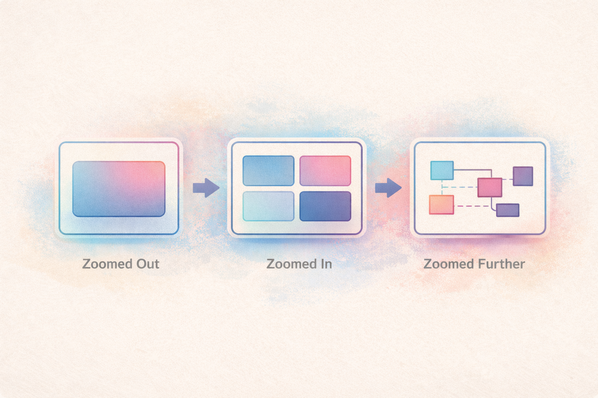

# There Is No Black Box

---

## Why This Matters

In conversations about artificial intelligence, one phrase appears repeatedly: *black box*.

The term carries weight. It suggests opacity, unknowability, and a loss of control. It implies that something essential is happening inside the system that no one can meaningfully understand.

But engineers work with black boxes every day.

The question is not whether black boxes exist.  
The question is whether we understand what a black box actually is.

---

## Encapsulation Is Not Ignorance

Software engineering depends on abstraction.

Functions encapsulate logic.  
APIs encapsulate systems.  
Modules encapsulate state.  
Libraries encapsulate entire domains of complexity.

From the outside, these are black boxes.

From the inside, they are simply another level of zoom.

Encapsulation is not a flaw in engineering — it is how we survive complexity under cognitive limits.

---

## Perspective Is Relative

No engineer sees the entire system at once.

Zoom in far enough and a function becomes readable.  
Zoom out far enough and that same function collapses into a single conceptual node.

There is no absolute vantage point from which the entire graph is visible simultaneously.

What appears opaque from one perspective becomes legible from another.

*Black boxes are often boundaries between levels of abstraction, not barriers to understanding.*

The “black box” is not a metaphysical object.  
It is a boundary.

---

## AI as Amplified Abstraction

AI systems feel different because of scale.

Neural networks compress vast statistical relationships into weight matrices. Latent spaces represent high-dimensional structures that cannot be intuitively visualized.

But scale does not make them mystical.

They are still:

- Mathematical models  
- Parameterized functions  
- Optimization processes  
- Encapsulated abstractions  

The abstraction layer is simply larger.

What feels unknowable is often just outside your current zoom level.

---

## Gist Thinking and Compression

Humans do not operate on raw detail. We operate on compressed meaning.

Cognitive Load Theory shows that working memory is limited. When systems grow large, we rely on abstraction — or what might be called *gist thinking* — to move forward.

We extract structural meaning without holding every internal detail at once.

Expert engineers do this constantly.

The risk is not abstraction itself.

The risk is compression without return.

Abstraction must be followed by verification.

AI accelerates compression.  
It does not eliminate the need for grounding.

---

## Creative Practice and AI

In creative work, AI functions as an abstraction amplifier.

It can generate variation quickly.  
It can surface patterns.  
It can expand a design space at speed.

But vision still belongs to the human.

Writing anchors abstraction.  
Story provides direction.  
Intent determines evaluation.

AI may assist in navigating the space.  
It does not determine where to go.

---

## The Real Risk

The danger is not that AI is a black box.

The danger is forgetting to zoom back in.

When we rely exclusively on encapsulated outputs without inspecting assumptions, we lose calibration.

That loss is not technological.  
It is cognitive.

Engineering has always required oscillation:

Zoom out to design.  
Zoom in to verify.

AI increases the speed of abstraction.  
It increases — not decreases — the responsibility to return to detail.

---

## References

Sweller, J. (1988).  
*Cognitive load during problem solving: Effects on learning.*  
Cognitive Science, 12(2), 257–285.  
https://doi.org/10.1207/s15516709cog1202_4  

Miller, G. A. (1956).  
*The magical number seven, plus or minus two: Some limits on our capacity for processing information.*  
Psychological Review, 63(2), 81–97.  
https://doi.org/10.1037/h0043158  

Mark, G., Gudith, D., & Klocke, U. (2008).  
*The cost of interrupted work: More speed and stress.*  
Proceedings of the SIGCHI Conference on Human Factors in Computing Systems.  
https://doi.org/10.1145/1357054.1357072  

Parnas, D. L. (1972).  
*On the criteria to be used in decomposing systems into modules.*  
Communications of the ACM, 15(12), 1053–1058.  
https://doi.org/10.1145/361598.361623  

Maslach, C., & Leiter, M. P. (2016).  
*Understanding the burnout experience: Recent research and its implications for psychiatry.*  
World Psychiatry, 15(2), 103–111.  
https://doi.org/10.1002/wps.20311  

Simon, H. A. (1956).  
*Rational choice and the structure of the environment.*  
Psychological Review, 63(2), 129–138.  
https://doi.org/10.1037/h0042769  

---

## Closing Reflection

There is no true black box — only boundaries we have not crossed.

Engineering has always depended on abstraction. AI extends that pattern, but it does not redefine it.

What matters is not whether systems contain hidden layers.

What matters is whether we remember that zoom is possible — and that responsibility lives at every level.
