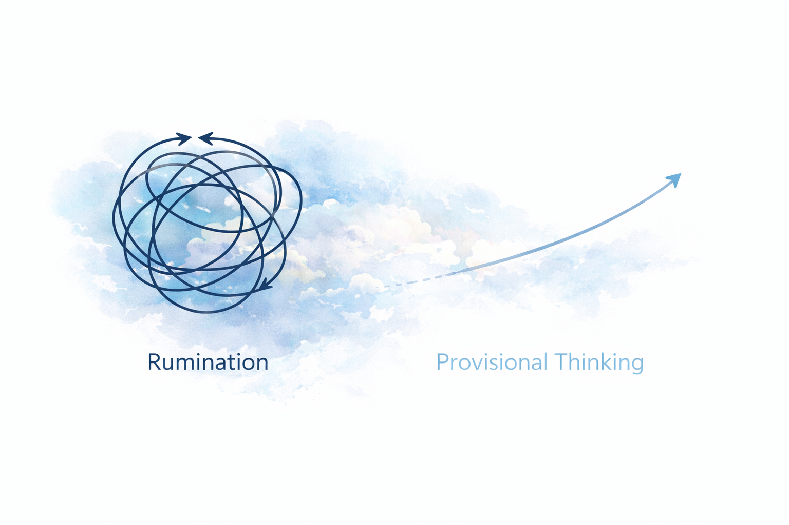
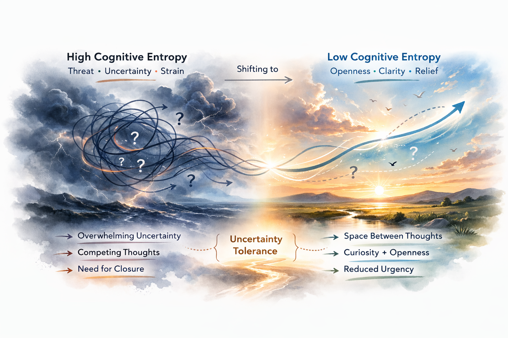

# The Freedom of Not Knowing

There is a quiet pressure in modern life to have an answer for everything.

Political opinions. Philosophical positions. Career trajectories. Identity labels. Life plans.

We are rewarded for clarity. For decisiveness. For confident declarations.

But beneath that pressure sits something more primitive:

The need to know.

And when we cannot know, something in us tightens.

---

## The Burden of Needing to Know

Ambiguity is uncomfortable.

When a question remains unresolved, the mind does not simply let it float. It searches. It reaches. It wants closure.

Psychologists describe this as a “need for cognitive closure” — the motivational pull to arrive at an answer and lock it in. When uncertainty lingers, we tend to “seize” the first plausible explanation and then “freeze” around it.

This is not a flaw in character. It is a feature of cognition.

Unresolved uncertainty consumes energy. It keeps prediction systems active. It maintains vigilance.

The problem is not that we seek answers.

The problem is when we treat premature answers as relief.

---

## Why Uncertainty Feels Threatening

The brain is a prediction engine.

It constantly anticipates outcomes and adjusts based on error signals. When predictions fail or when outcomes remain unknown, the system registers discrepancy.

That discrepancy feels like tension.

Research in anxiety shows that intolerance of uncertainty is one of the strongest drivers of persistent worry. Not knowing what will happen activates threat systems. The unknown becomes something to defend against.

Some researchers describe this as “psychological entropy” — a state of cognitive disorder where too many possibilities remain unresolved. The mind interprets this entropy as destabilizing.

Rumination often follows. We loop through possibilities, replay scenarios, and attempt to simulate our way into certainty.

But simulation is not resolution.

And prolonged rumination does not create clarity. It amplifies strain.

---

*Uncertainty increases cognitive load. The drive for closure often accelerates prematurely.*

---

## Relief Through Release

There is another option.

Instead of forcing resolution, we can allow provisionality.

Not ignorance. Not apathy.

Provisionality.

The simple recognition:

“I do not know this fully — and that is acceptable.”

When the demand for ultimate answers loosens, something subtle shifts in the nervous system.

The loop slows.

Energy reallocates.

Attention stabilizes.

This is not mystical surrender. It is cognitive regulation.

When we stop demanding finality from questions that cannot yet be resolved, we reduce the prediction burden placed on the brain.

Relief comes not from answers themselves, but from releasing the insistence on having them immediately.

---

## Freedom and Creativity

There is a second effect.

When we are not gripping certainty, our thinking expands.

Creative work thrives in ambiguity. Design space opens when solutions are not prematurely locked. Exploration becomes possible when identity is not fused to a single position.

Psychological flexibility — the ability to adapt thoughts and behavior in response to changing information — is strongly associated with well-being.

Not knowing, when held correctly, is not paralysis.

It is space.

Space to explore.
Space to update.
Space to choose deliberately rather than reactively.

---

*Stability emerges not from certainty, but from flexible response to uncertainty.*

---

## Practicing Not Knowing

Freedom from forced certainty does not happen automatically. It can be practiced.

A few disciplined shifts help:

- Replace “What is the final truth?” with “What is the most reliable model right now?”
- Replace “I need to resolve this” with “I can revisit this with more information.”
- Separate identity from belief.
- Allow questions to remain open without filling them immediately.

This does not mean abandoning responsibility.

It means resisting premature closure.

There is strength in holding uncertainty without collapsing into it.

There is relief in recognizing that not every open question requires immediate resolution.

---

## Closing Reflection

You will not answer every philosophical question.

You will not resolve every ambiguity in your life.

You will not eliminate uncertainty from the human condition.

But you do not need to.

When the demand for absolute knowing softens, something steadier takes its place.

Clarity without rigidity.

Curiosity without panic.

Freedom without denial.

Not knowing is not a failure of intelligence.

Sometimes, it is its maturation.
