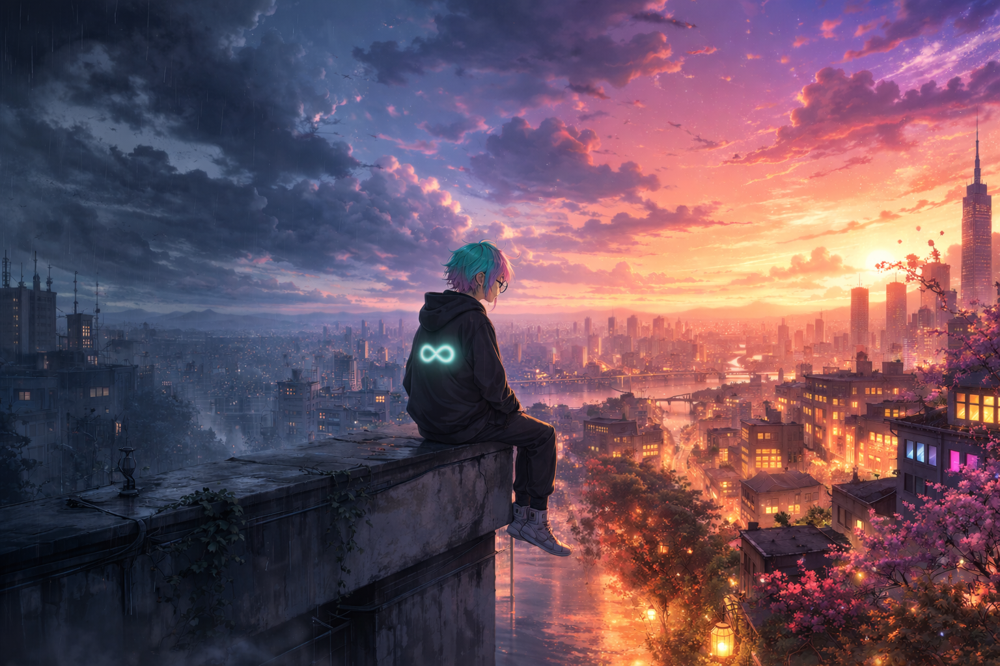
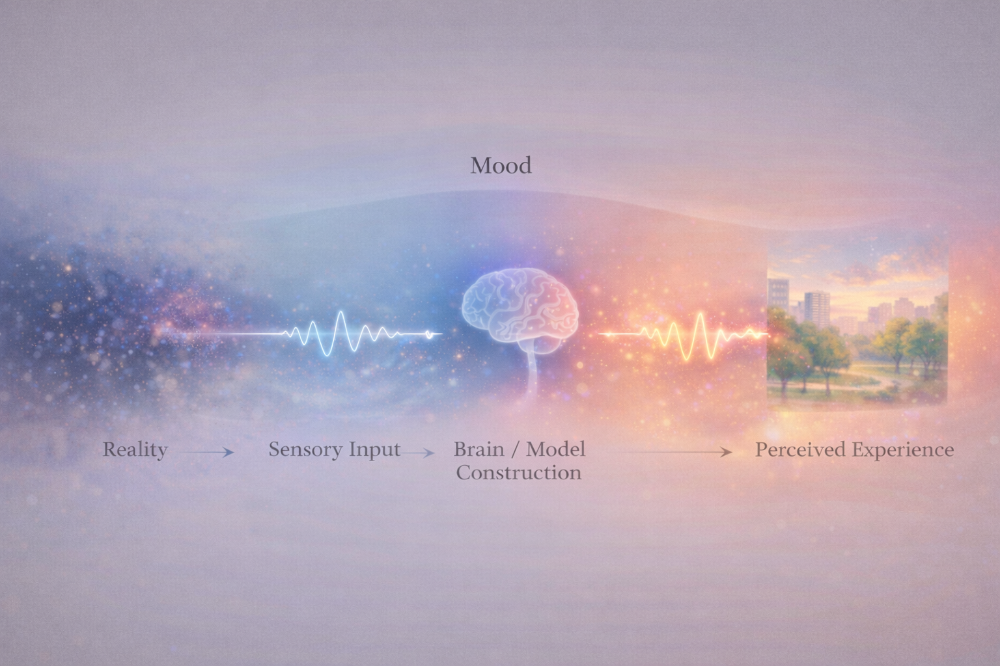
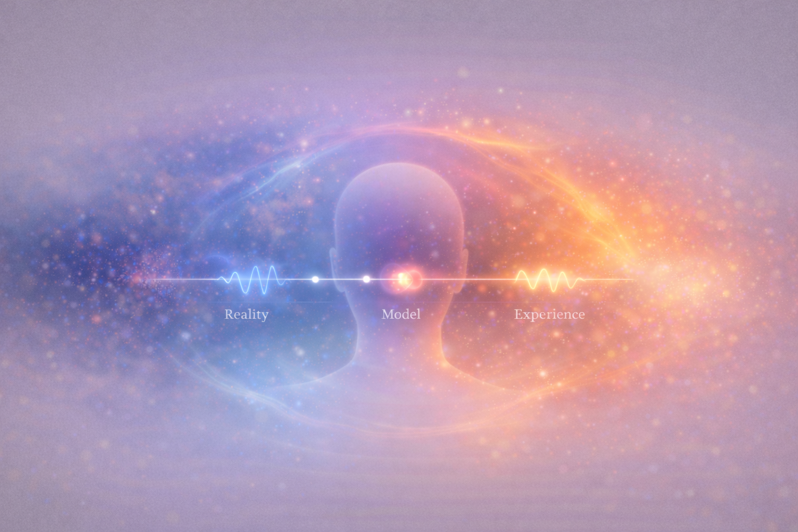

# 🌈 Mood Colors Your Reality

*The world does not change — the way it is rendered does.*

---

## Introduction

I noticed something simple.

Nothing felt funny.

Not in a dramatic way. Just… flat.

The same things that would normally make me laugh didn’t land the same. The words were the same. The timing was the same. But the experience was different.

And that raised a question:

Was nothing funny…

or was I just not in a state where things could feel funny?

---

## The Same World, Different Experience

We tend to assume that reality is stable.

That things *are* funny, or interesting, or meaningful — and we react to them.

But in practice, that’s not what happens.

The same:

- joke  
- song  
- conversation  
- moment  

can feel completely different depending on the state you’re in.

Not slightly different.

Fundamentally different.

Which suggests something important:

The world you experience is not just determined by what happens.

It is shaped by the state you are in while it happens.

---

*The same input can produce completely different experiences depending on internal state.*

---

## We Don’t See Raw Reality

It’s tempting to think we’re just seeing what’s there.

But we don’t experience raw reality directly.

What we experience is constructed.

Sensory input comes in incomplete and fragmented, and the brain builds a usable model from it.

Not pixels, but an image.

We don’t see the data.

We see the result of the system interpreting the data.

---

*We do not experience reality directly — we experience a constructed model of it.*

---

## Mood Is Not Just a Feeling

We usually think of mood as something that sits on top of experience.

Like a reaction.

But it doesn’t feel like that.

It feels like mood is already there — shaping things before we even think about them.

A better way to understand it is this:

Mood is not a local reaction.

It is a global condition.

---

## Mood as a Rendering Condition

If perception is a kind of rendering process, then mood is part of how that rendering is configured.

Not the content.

Not the structure.

But the conditions under which everything is interpreted.

Like:

- brightness  
- contrast  
- color  
- intensity  

The same underlying “scene” can be rendered in completely different ways.

Nothing external has to change.

But the experience does.

---

*Mood acts as a global condition that shapes how perception is constructed — not as a single step, but as a pervasive influence.*

---

## When Meaning Changes or Disappears

This becomes most obvious when something that normally feels meaningful suddenly doesn’t.

Nothing feels funny.

Music doesn’t hit the same.

Things feel distant, muted, or flat.

It’s not that meaning is gone.

It’s that access to it has changed.

The system is still running.

But it’s running under different conditions.

---

## The Illusion of Objectivity

When you’re inside a mood, it doesn’t feel like a filter.

It feels like reality.

That’s the tricky part.

Because from the inside, there’s no clear separation between:

- what is happening  
- and how it is being experienced  

They collapse into one.

Which makes it easy to assume:

“This is just how things are.”

---

## Regaining Degrees of Freedom

Recognizing this doesn’t invalidate your experience.

If something feels heavy, it *is* heavy in your experience.

But it introduces a subtle shift:

What you’re experiencing is real…

but it may not be the only way that reality can be experienced.

That creates space.

Not to force a different state.

But to remember:

The current rendering is not the only possible one.

---

## Closing Reflection

The world doesn’t always change.

But the way it appears to you does.

Mood doesn’t create reality.

But it colors it.

And sometimes, just seeing that is enough to loosen the grip of the moment you’re in.

---

## References

Friston, K. (2010). The free-energy principle: a unified brain theory? *Nature Reviews Neuroscience*, 11(2), 127–138.  
https://doi.org/10.1038/nrn2787

Clark, A. (2013). Whatever next? Predictive brains, situated agents, and the future of cognitive science. *Behavioral and Brain Sciences*, 36(3), 181–204.  
https://doi.org/10.1017/S0140525X12000477

Barrett, L. F. (2017). *How Emotions Are Made: The Secret Life of the Brain*. Houghton Mifflin Harcourt.  
(Constructionist view of emotion and perception)

Bower, G. H. (1981). Mood and memory. *American Psychologist*, 36(2), 129–148.  
https://doi.org/10.1037/0003-066X.36.2.129

Forgas, J. P. (1995). Mood and judgment: The affect infusion model (AIM). *Psychological Bulletin*, 117(1), 39–66.  
https://doi.org/10.1037/0033-2909.117.1.39

Mathews, A., & MacLeod, C. (2005). Cognitive vulnerability to emotional disorders. *Annual Review of Clinical Psychology*, 1, 167–195.  
https://doi.org/10.1146/annurev.clinpsy.1.102803.143916

Rottenberg, J., & Hindash, A. C. (2015). Emerging evidence for emotion context insensitivity in depression. *Current Opinion in Psychology*, 4, 1–5.  
https://doi.org/10.1016/j.copsyc.2014.12.025

Pizzagalli, D. A. (2014). Depression, stress, and anhedonia: toward a synthesis and integrated model. *Annual Review of Clinical Psychology*, 10, 393–423.  
https://doi.org/10.1146/annurev-clinpsy-050212-185606

Pessoa, L. (2008). On the relationship between emotion and cognition. *Nature Reviews Neuroscience*, 9(2), 148–158.  
https://doi.org/10.1038/nrn2317

Seth, A. K. (2013). Interoceptive inference, emotion, and the embodied self. *Trends in Cognitive Sciences*, 17(11), 565–573.  
https://doi.org/10.1016/j.tics.2013.09.007

